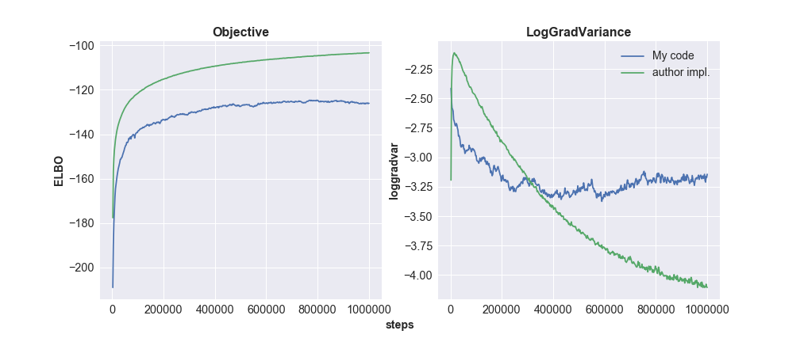
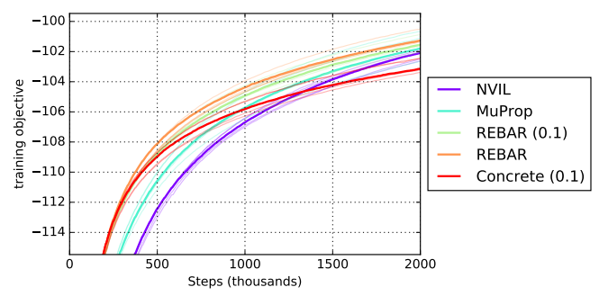

# **WORK IN PROGRESS**

## REBAR-pytorch
Implementation and replication of experiments for the [REBAR paper](https://papers.nips.cc/paper/6856-rebar-low-variance-unbiased-gradient-estimates-for-discrete-latent-variable-models.pdf) from NIPS 2017 in PyTorch

Tensorflow implementation by the authors [here](https://github.com/tensorflow/models/tree/master/research/rebar)

## Results

I have implemented REBAR for the toy problem in Section 5.1. See `rebar_toy.ipynb`.

I tried to implement REBAR for the binarized MNIST benchmark and the Sigmoid Belief Network model. Below, you can see the performance of my implementation versus the Tensorflow implementation by the authors. In this run, both models use 1 nonlinear stochastic layer, fixed temperature at 0.5, and fixed eta at 1.0 (the parameter that multiplies the gumbel control variate and is normally optimized with a variance objective). I have poured over my implementation and theirs and can't tell where I went wrong. I have looked at the weight initializations, gradients, etc., but I am new to this area of ML so I probably missed something. If anyone can figure out what's wrong with my implementation (or if it has to do with some weird PyTorch vs. Tensorflow thing??) please let me know!!!

Here are results for 1 nonlinear stochastic layer on binarized MNIST from the paper.

The results I'm getting seem to be slightly better with fixed temperature and eta parameters. As noted in Issue #1, REBAR is supposed to include a variance objective for optimizing eta, but I noticed that the eta values were staying very close to 1 when running the author's TF code so I haven't included that yet. 
